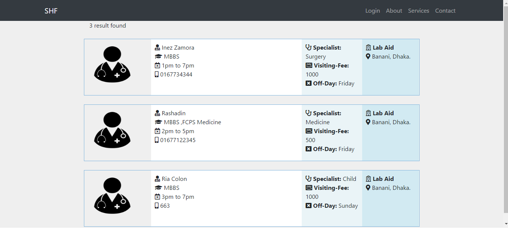

# Smart-Hospital-Finder
It was a project of my CSE411(Software Engineering).First I did the Requirement Engineering and later Designed the  Diagrams like Sequence Diagram, Activity Diagram, Class Diagram etc. Based on the analysis and the design I built this Smart Hospital Finder web app.

<b>The main features of this project</b>

<ul>
  <li>User will be able to know the Hospitals, doctors, available services information throughout the country</li>
  <li>Any hospital/diagnostic center can add their information</li>
  <li>User may search by any keywords and result will include hospitals, doctors, services, prices, available hours for a certain disease or location if the keyword matches.</li>
</ul>

<b>Used Tools</b>
<ul>
  <li>PHP 7.1.20</li>
  <li>MySQL</li>
  <li>Ajax</li>
  <li>Javascript</li>
  <li>jQuery</li>
</ul>

<h4>Front page</h4>
 

<h4>Select Specialist</h4>
 

<h4>search results for Hospital’s search</h4>
 

<h4> search results for Doctor’s search </h4>
 

<h4>Login page</h4>
 

<h4>Registration page</h4>
 

<h4>Add Doctor page for the Hospital’s</h4>
<br

